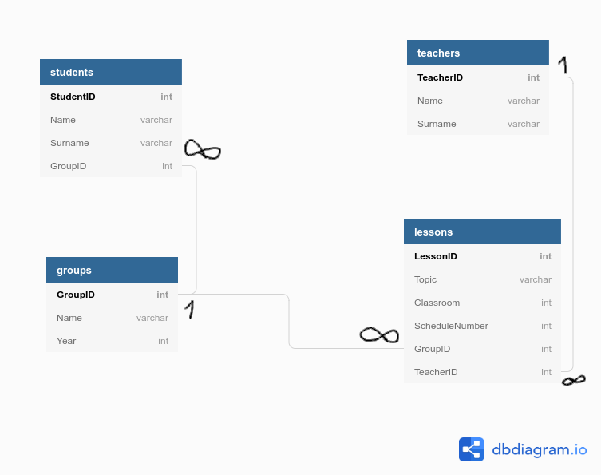

# school-rest-api

RESTful API for School model

** **
## Installing
**Version of `node` must be at least 12.18.2**

1. Run `npm install` for install all project dependecies;
2. **Create `.env` file in `./src/config` directory and put there your DB and HTTP configurations such as `./src/config/.env.instance`.**

** **
## Running server
* `npm run server` - run Node.js server
** **

# Schema of DB

